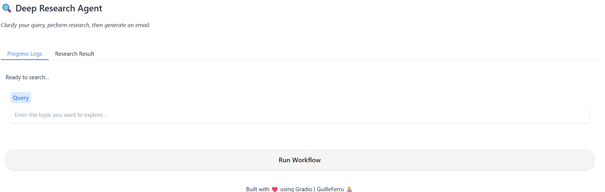

# Deep Research Agent

## Overview

Deep Research Agent is an AI-powered research assistant that helps users conduct comprehensive research on any topic. The application uses a multi-agent system to refine queries, plan search strategies, gather information, and generate detailed research reports.



## Features

- **Interactive Query Refinement**: Asks clarifying questions to understand research needs
- **Intelligent Search Planning**: Generates targeted search queries based on the refined research question
- **Comprehensive Web Search**: Conducts multiple web searches to gather diverse information
- **Detailed Report Generation**: Creates well-structured, in-depth research reports with citations
- **User-Friendly Interface**: Simple Gradio-based UI for easy interaction

## Architecture

The system consists of several specialized AI agents working together:

1. **Refinement Agent**: Improves the initial query by asking up to two clarifying questions
2. **Planner Agent**: Develops a search strategy with multiple targeted queries
3. **Search Agent**: Executes web searches and summarizes findings
4. **Writer Agent**: Synthesizes all research into a comprehensive report

## Installation

### Prerequisites
- Python 3.9+
- Required Python packages (see requirements below)

### Setup

1. Clone the repository:
```bash
git clone https://github.com/GuilleFerru/deep-research.git
cd deep-research
```

2. Set up a virtual environment:
```bash
python -m venv .venv
# On Windows
.venv\Scripts\activate
# On Unix or MacOS
source .venv/bin/activate
```

3. Install dependencies:
```bash
pip install -r requirements.txt
```

4. Create a `.env` file in the root directory with your API keys:
```
AI_MODEL=your_ai_model_name
# Add any other required API keys
```

## Usage

1. Start the application:
```bash
python src/main.py
```

2. The Gradio interface will open in your default web browser

3. Enter your research query in the text box and click "Run Workflow"

4. The system will:
   - Ask clarifying questions if needed
   - Develop and execute a search strategy
   - Generate a comprehensive research report

5. Monitor progress in the "Progress Logs" tab and view the final report in the "Research Result" tab

## Project Structure

```
deep_research/
├── src/
│   ├── agents.py            # Base agent implementation
│   ├── gradio_ui.py         # Gradio UI implementation
│   ├── main.py              # Main application entry point
│   ├── planner_agent.py     # Search planning agent
│   ├── refinement_agent.py  # Query refinement agent
│   ├── search_agent.py      # Web search agent
│   ├── search_manager.py    # Manages the research workflow
│   ├── writer_agent.py      # Report generation agent
│   └── utils/
│       ├── custom_styles.css # Custom CSS for the UI
│       └── markdown_formater.py # Formats research results as Markdown
└── .env                    # Environment variables (API keys)
```

## How It Works

1. **Query Refinement**:
   - The system analyzes your initial query
   - If needed, it asks up to two clarifying questions
   - The refined query captures your specific research needs

2. **Search Planning**:
   - The planner agent creates a strategy with multiple search queries
   - Each query targets a specific aspect of your research topic

3. **Information Gathering**:
   - The search agent executes each planned search query
   - It summarizes the findings from each search

4. **Report Generation**:
   - The writer agent synthesizes all search results
   - It creates a structured, comprehensive research report
   - The report includes a summary and follow-up questions

## Requirements

- Python 3.9+
- gradio
- pydantic
- python-dotenv
- asyncio
- openai (or other AI model provider)

## Demo


## License

MIT License

## Contributors

- [GuilleFerru](https://github.com/GuilleFerru)

## Acknowledgments

- Built with [Gradio](https://www.gradio.app/) for the user interface
- Powered by advanced AI language models

---

*Note: This project requires API access to AI models for operation. Make sure to set up your environment variables properly before running the application.*

